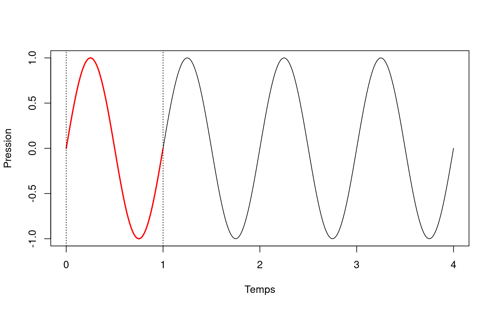
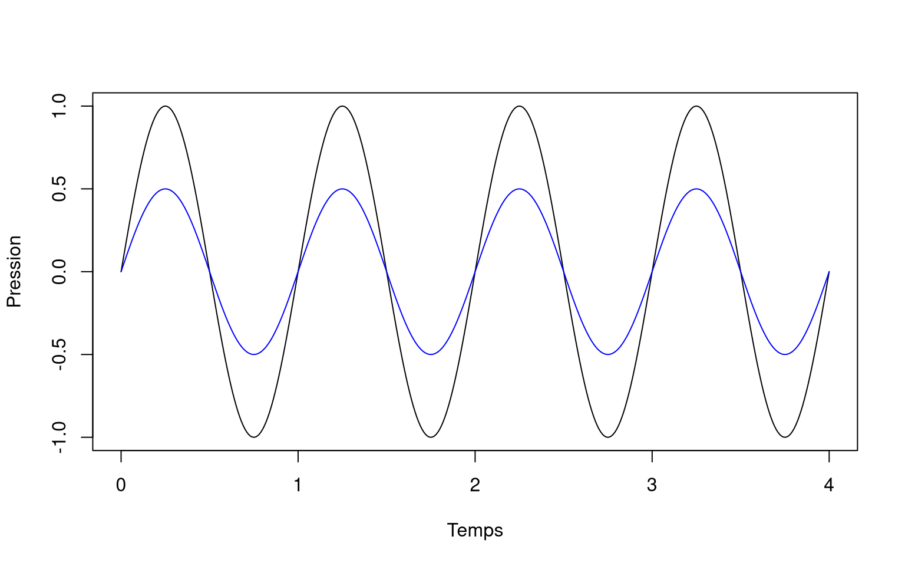
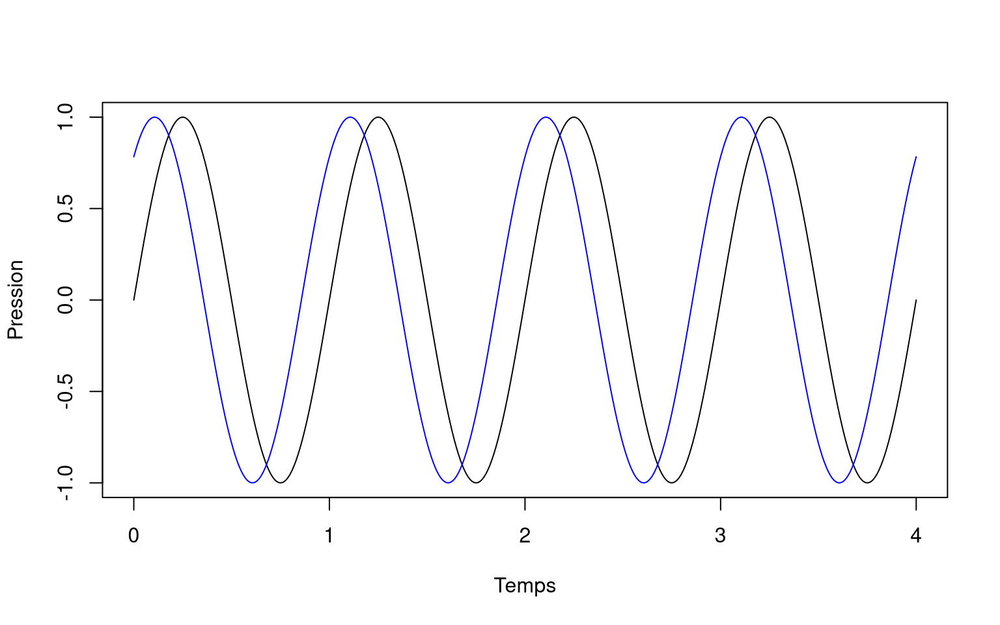

Un son, c'est une vibration qui se propage dans un milieu (l'air ou l'eau par exemple).

Cette vibration peut être produite par le mouvement d'un objet (une corde de guitare, une membrane de tambour).

En bougeant dans le milieu, cet objet crée un alternance de pressions et de dépressions dans le milieu.

Ce sont ces variations de pression qui se propagent et qui sont captées par nos oreilles ou par les microphones de nos enregistreurs passifs.

Pour représenter les augmentations puis diminutions susccessives de la pression, on utilise généralement une sinusoïde.

Il existe deux caractéristiques principales qui permettent de décrire ce son.

## Les sons simples

### La fréquence

Le son est un signal périodique, il se répète à l'identique au cours du temps.

Sur le son précédent, on peut identifier le motif le plus cours qui se répète. On appelle ce motif la période.

La fréquence du son, c'est le nombre de fois que la période se répète en une seconde. On l'exprime en hertz (Hz).

Ici notre signal a une fréquence de 1 Hz, car sa période dure exactement 1 seconde

La sensation auditive associée à la fréquence correspond à des sons perçus comme plus ou moins graves ou aigus. Plus la fréquence est grande (beaucoup de périodes en une seconde), plus le son nous parait aigu.

L'oreille humaine est capable de percevoir des sons allant de 20 à 20000 Hz, soit de 20 à 20000 périodes par seconde. En dessous de 20 Hz, ce sont des infrasons, au dessus de 20 000 Hz, ce sont des ultrasons.

### L'amplitude

L'amplitude d'un son représente l'intensité de la variation de pression.

Deux sons peuvent avoir la même fréquence, mais des pressions maximales et minimales différentes.

L'amplitude d'un son, c'est l'étendue des pressions produites par le son.

La sensation auditive associée à l'amplitude correspond au volume sonore. Plus l'amplitude est grande, plus le son parait fort.

## Les sons complexes

### La phase

En pratique il existe une troisième caractéristique pour décrire un son. Il s'agit de la phase.

Deux sons peuvent avoir exactement la même féquence et la même amplitude, mais être légèrement décalés dans le temps. C'est leur phase qui est différente.

### Des sons composés

Les sons présentés ici sont dits "purs" car ils ne contiennent qu'une seule sinusoïde. Mais en pratique, les signaux sonores sont généralement beaucoup plus complexes. Un son complexe peu être considéré comme un assemblage d'une multitude de sons purs de différentes fréquences, amplitudes et phases.

Ainsi, la première étape de l'analyse d'un signal complexe est bien souvent de décomposer un son complexe en une série de sons simples. C'est la fonction du spectrogramme.
