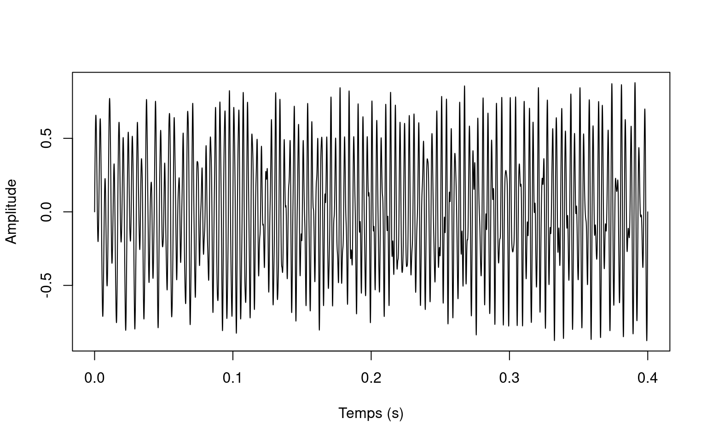
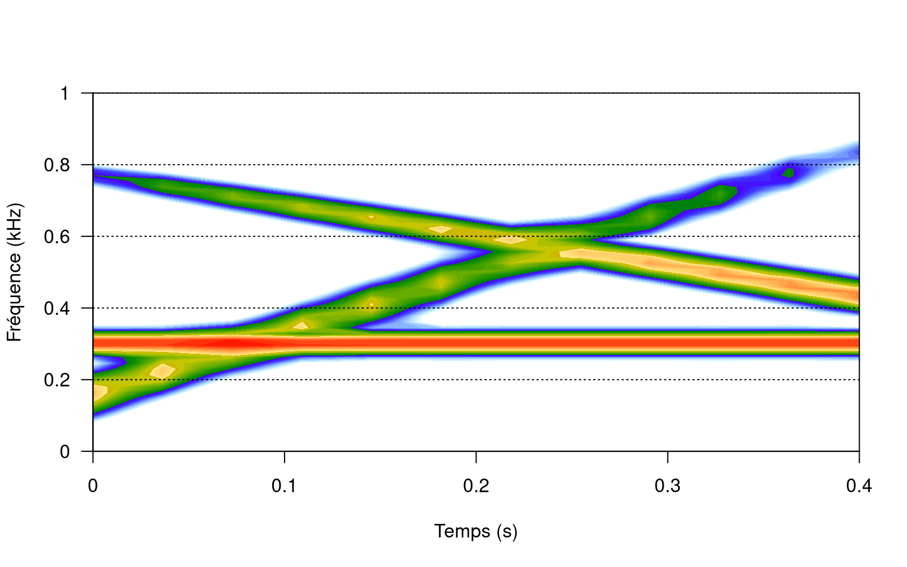

## Oscillogramme

Les sons que l'on enregistre sont des signaux complexes, composés de différentes fréquences et amplitudes. La représentation la plus simple est celle de la forme d'onde, qui affiche la pression en fonction du temps.

## Spectrogramme

Pour faciliter la visualisation des fréquences et amplitudes composant un signal, on utilise un spectrogramme.

On affiche trois éléments en même temps:

- le temps, sur l'axe des abscisses ;
- la fréquence, sur l'axe des ordonnées ;
- et l'amplitude, représentée par les gradients de couleurs.

