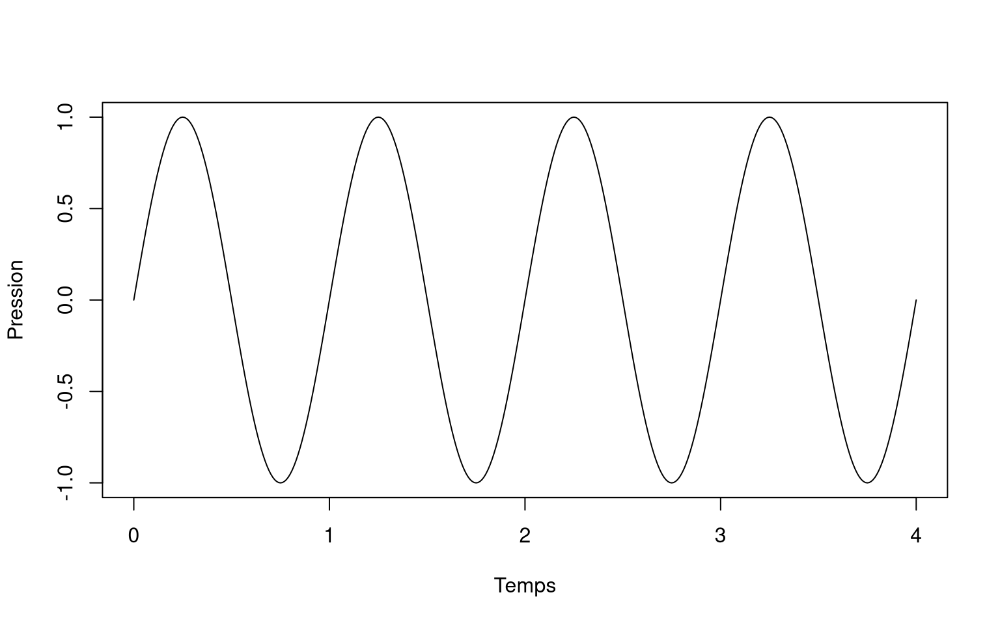
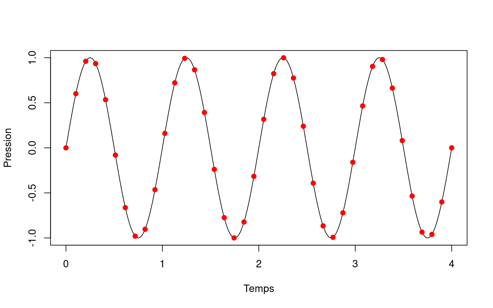
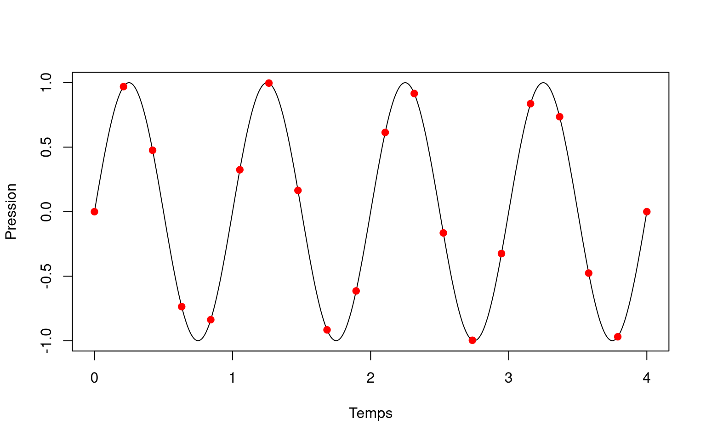
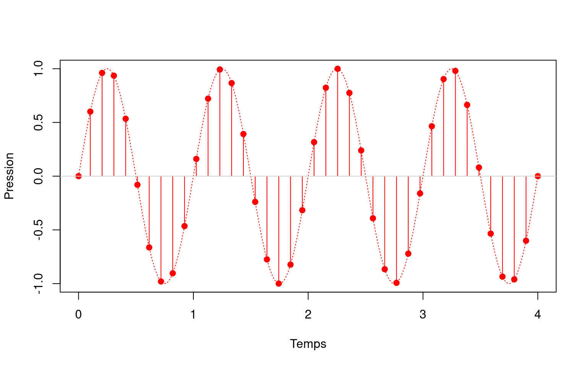
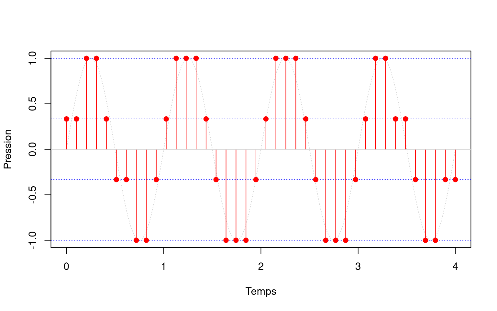
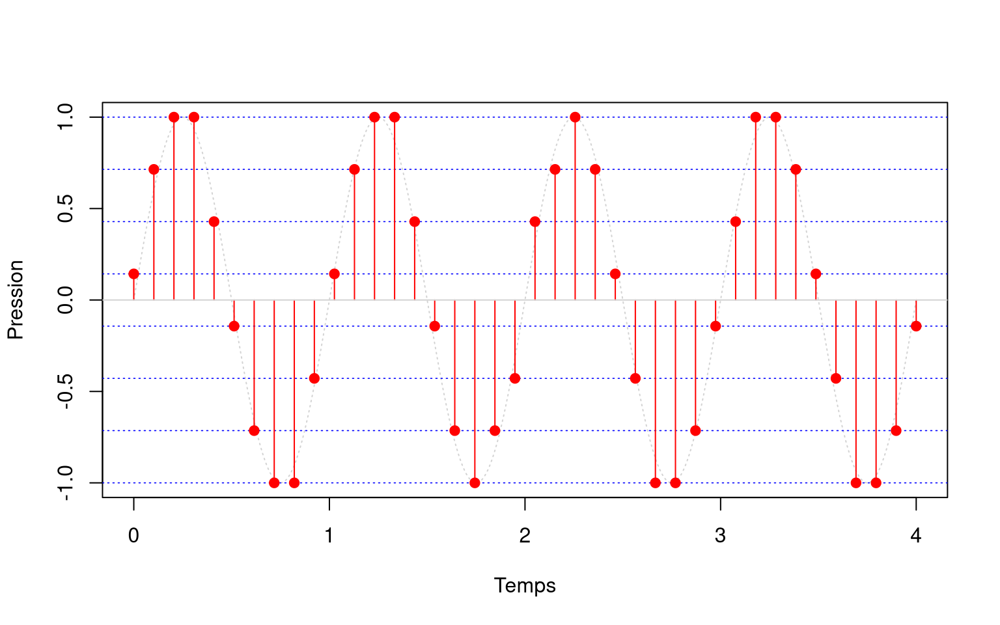
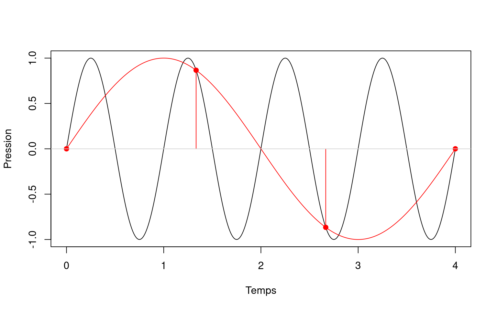

Une onde sonore peut être représentée par un signal sinusoïdal.

<details class="code-fold">
<summary>Code</summary>

``` r
x = seq(0,4,0.01)
y = sin(2*pi*x)
plot(x,y,type="l",xlab="Temps", ylab="Pression")
```

</details>



Ce signal corespond aux variations de pression au cours du temps dans du milieu de propagation du son.

Ce signal est dit **analogique** car il varie continuellement au cours du temps.

Pour traiter ce signal avec des appareils numériques, on ne peut pas le garder sous cette forme.
On doit créer un signal **numérique**.

Pour cela on doit discrétiser le signal sur le temps et sur l'amplitude.

## Discrétiser sur le temps: la fréquence d'échantillonnage

On ne peut pas stocker la valeur d'amplitude du signal pour un temps continu, on aurait une infinité de valeurs à stocker.

Ce que l'on fait, c'est échantillonner la valeur de l'amplitude à intervelles réguliers.
On peut par exemple réaliser une mesure d'amplitude à chaque seconde, dix fois par seconde, cent fois, mille fois...
Le nombre de fois par seconde que l'on effectue une mesure correspond à la fréquence d'échantillonnage.
Plus cette fréquence est élevée, plus on aura une représentation fine du son, et plus on sera capable de détecter des sons aigus (qui eux aussi ont une haute fréquence).
Par contre, ça veut aussi dire que l'on aura plus de valeurs à stocker, et donc des fichiers audio plus volumineux.

Par exemple avec une fréquence d'échantillonnage de 10 Hz (10 fois par seconde) on a 40 échantillons à stocker pour 4 secondes de signal.

<details class="code-fold">
<summary>Code</summary>

``` r
x = seq(0,4,0.01)
y = sin(2*pi*x)
plot(x,y,type="l",xlab="Temps", ylab="Pression")

sf = 10

xp = seq(0,4,length.out=4*sf)
yp = sin(2*pi*xp)

points(xp, yp, pch=19, col="red")
```

</details>



Et avec 5 Hz, on en a 20.

<details class="code-fold">
<summary>Code</summary>

``` r
x = seq(0,4,0.01)
y = sin(2*pi*x)
plot(x,y,type="l",xlab="Temps", ylab="Pression")

sf = 5

xp = seq(0,4,length.out=4*sf)
yp = sin(2*pi*xp)

points(xp, yp, pch=19, col="red")
```

</details>



À partir de ces échantillons on peut reproduire un signal numérique.

<details class="code-fold">
<summary>Code</summary>

``` r
sf = 10

xp = seq(0,4,length.out=4*sf)
yp = sin(2*pi*xp)

plot(xp,yp,col="red",pch=19,xlab="Temps", ylab="Pression")

segments(x0=xp, y0=0, x1=xp, y1=yp, col="red")


x = seq(0,4,0.01)
y = sin(2*pi*x)
points(x,y,type="l",col="red",lty="dotted")

abline(h=0,col = "lightgray")
```

</details>



## Discrétiser sur l'amplitude: la quantification

Une fois que le signal est discrétisé sur le temps, il faut le discrétiser sur l'amplitude afin de ne pas avoir une infinité de valeurs possibles à stocker.

Pour ce faire, on décide à l'avance du nombre de valeurs possibles que l'on souhaite utiliser pour discrétiser l'amplitude. On mesure ce nombre de valeurs possible en bits. Avec un bit on peut encoder 2^1 valeurs, soit 2 valeurs. Avec deux bits on peut en encoder 2^2 valeurs (soit 4 valeurs) etc... On appelle cette valeur la profondeur d'encodage.

En pratique les appareils actuels ne sont pas vraiment limités. Avec 16 bits, voire 32 bits c'est largement suffisant pour enregistrer un son avec une bonne qualité.

Dans notre exemple on pourrait quantifier notre signal en 2 bits. Cela consiste à séparer notre amplitude maximale en 4 intervalles identiques et attribuer à chaque échantillon audio la valeur de l'intervalle la plu proche.

<details class="code-fold">
<summary>Code</summary>

``` r
x = seq(0,4,0.01)
y = sin(2*pi*x)

plot(x, y, type="l", col="lightgray", lty="dotted", xlab="Temps", ylab="Pression")

n_bits = 2
n_niveaux = 2^n_bits
niveaux = seq(-1, 1, length.out = n_niveaux)

abline(h = niveaux, col = "blue", lty = "dotted", lwd = 0.8)

sf = 10
xp = seq(0, 4, length.out = 4*sf)
yp = sin(2*pi*xp)

yp_quant = sapply(yp, function(v) niveaux[which.min(abs(niveaux - v))])

segments(x0 = xp, y0 = 0, x1 = xp, y1 = yp_quant, col = "red")
points(xp, yp_quant, col = "red", pch = 19)

abline(h = 0, col = "lightgray")
```

</details>



On pourrait aussi le faire en 3 bits. Les échantillons s'ajustent déjà beaucoup mieux à l'amplitude.

<details class="code-fold">
<summary>Code</summary>

``` r
x = seq(0,4,0.01)
y = sin(2*pi*x)

plot(x, y, type="l", col="lightgray", lty="dotted", xlab="Temps", ylab="Pression")

n_bits = 3
n_niveaux = 2^n_bits
niveaux = seq(-1, 1, length.out = n_niveaux)

abline(h = niveaux, col = "blue", lty = "dotted", lwd = 0.8)

sf = 10
xp = seq(0, 4, length.out = 4*sf)
yp = sin(2*pi*xp)

yp_quant = sapply(yp, function(v) niveaux[which.min(abs(niveaux - v))])

segments(x0 = xp, y0 = 0, x1 = xp, y1 = yp_quant, col = "red")
points(xp, yp_quant, col = "red", pch = 19)

abline(h = 0, col = "lightgray")
```

</details>



## La fréquence de Nyquist

Revenons un instant à la fréquence d'échantillonnage.

Plus on augmente la fréquence d'échantillonnage, plus on sera capable de mesurer des sons aigus (qui ont une fréquence d'oscillation élevée).

Mais dans tous les cas, on doit utiliser une fréquence d'échantillonnage équivalente à au moins deux fois la plus haute fréquence que l'on doit enregistrer.

Par exemple avec notre signal de 1 Hz, on doit utiliser une fréquence d'échantillonnage minimale de 2 Hz.

Si l'on ne respecte pas cette règle, on risque de voir apparaitre des "fréquences fantômes" dans notre signal numérique.

Par exemple si dans notre signal de 1 Hz on utilise une fréquence d'échantillonnage de 1 Hz, on aura l'apparition d'une "fréquence fantôme" de 0,25 Hz. On parle de repliement de spectre.

<details class="code-fold">
<summary>Code</summary>

``` r
sf = 1

x = seq(0,4,0.01)
y = sin(2*pi*x)
plot(x,y,type="l",xlab="Temps", ylab="Pression")

xp = seq(0,4,length.out=4*sf)
yp = sin(2*pi*xp)

points(xp,yp,col="red",pch=19)


ya = sin(2*pi*x*0.25)
points(x,ya,col="red",type="l")

segments(x0=xp, y0=0, x1=xp, y1=yp, col="red")


abline(h=0,col = "lightgray")
```

</details>


